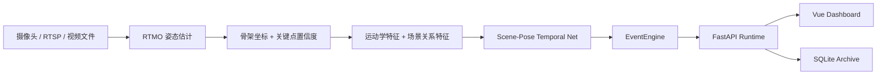

<div align="center">

# 护龄智守 Huling Guard

面向固定机位场景的连续状态安全值守系统

[](#当前模型状态) [](#快速启动) [](#产品界面) [](#系统白盒主链) [](#快速启动) [](#许可说明)

把连续视频流转换为可处置的照护过程，而不是只输出一帧结果。

</div>

## 系统定调

护龄智守不是单帧人体检测演示，也不是只播一个结果标签的前端壳子。

当前主线是：`RTMO` 姿态估计 + 自研 `Scene-Pose Temporal Net` 时序 `Transformer` + `EventEngine` 事件引擎。系统重点解决的是连续过程判断：人在这几秒内是正常活动、正在失衡、已经跌倒、正在恢复，还是已经进入长卧风险。

这条路线的目标很明确：

- 不被单帧姿态干扰带偏结论
- 不把床上正常躺卧误判为地面长卧
- 不把上传视频复核、模拟监看、实时接入拆成三套逻辑
- 不把阈值、步长、运行参数暴露给普通值守用户

## 系统白盒主链

<details>
<summary><b>展开查看主链 Pipeline</b></summary>



</details>

## 为什么是这条路线

### 1. 不把主任务错当成“画人框”

这个系统的核心任务不是“检测到一个人”，而是判断一段连续过程中的状态变化。因此主线不是 YOLO 检测框，而是姿态序列和时序状态建模。

- `RTMO` 直接输出 17 点姿态与关键点置信度
- 时序网络用骨架、速度、躯干角度和场景关系理解动作过程
- `EventEngine` 把概率流稳定成真正可处置的事件

系统现在已经支持在回放里叠加“骨架/框”可视化，但这个框来自真实关键点外接范围，不是第二套检测模型。

### 2. 场景先验直接参与误报控制

房间先验初始化采用 `Grounding DINO + SAM 2`，只在离线阶段执行，不进入实时链路。它的任务是把床、沙发、椅子、地面等关键区域提前识别出来，帮助运行时判断“躺在床上”和“倒在地上”的区别。

### 3. 应用层与模型层口径一致

- 训练链和运行时链共享同一套状态定义
- 历史回看、上传复核、实时接入都走同一条状态判读口径
- 不提供两套模型切换按钮，不做兜底运行栈

## 产品界面

当前前端分为三个主页面：

- `实时值守`：当前状态、风险变化、建议动作、最近提醒
- `历史回看`：已保存过程、状态筛选、页签式回放与复核
- `系统信息`：运行主链、接入方式、质量控制、参数边界

当前运行时支持三种输入入口：

| 输入方式 | 说明 | 适用场景 |
| --- | --- | --- |
| `实时接入` | 通过摄像头编号、RTSP 或容器内路径接入连续视频流 | 真正部署、联调摄像头 |
| `模拟监看` | 用固定机位样例视频按实时节奏推理 | 演示、封闭环境测试 |
| `上传复核` | 上传一段新视频后异步分析并归档 | 复查、数据回灌、案例留档 |

## 摄像头接入边界

系统接的是视频源，不绑定某一家摄像头厂商 SDK。

当前可接入的形式：

- 本机摄像头：例如 `0`
- RTSP 流：例如 `rtsp://user:pass@ip:554/...`
- 本地视频路径：例如 `/data/demo/fall.mp4`

如果后面买家用摄像头，满足下面任一条件即可接入：

- 直接提供 `RTSP`
- 通过 `NVR / ONVIF 网关 / 厂商网关` 转成 `RTSP`
- 作为本机可见视频设备挂到运行环境里

纯云端封闭摄像头如果拿不到 `RTSP / 本地流 / 设备节点`，当前系统不能直接接入。

## 当前模型状态

截至 `2026-04-11`，当前结论如下：

- `v29` 是目前最接近晋级的实验轮次
- `v29` 样本级 `accuracy = 0.8902`、`macro_f1 = 0.7355`、`weighted_f1 = 0.8875`
- `v29` 的 `fall / recovery / prolonged_lying` 均优于 `v21`
- `v29` 的 `near_fall_f1` 仍从 `0.6667` 回落到 `0.6000`
- `v30` 把 `sample_loss_weight` 从 `0.50` 提到 `0.65` 后，样本级 `macro_f1` 回落到 `0.6951`，确认不是当前优先方向

当前真实结论不是“模型已经最终定版”，而是：

- `v29` 进入 `review` 口径
- 下一步继续做应用级复核
- 当前保留发布包仍不能被 `v21 ~ v30` 任一实验无条件替换

## 快速启动

### Docker 运行

```bash
docker compose -f docker-compose.runtime.yml up --build
```

默认地址：

- 实时值守：<http://127.0.0.1:18014/dashboard#/live>
- 历史回看：<http://127.0.0.1:18014/dashboard#/records>
- 系统信息：<http://127.0.0.1:18014/dashboard#/system>

### 运行目录

| 目录 | 说明 |
| --- | --- |
| `runtime-release/` | 运行时发布包 |
| `runtime-demo/` | 模拟监看视频、预测结果、会话报告 |
| `runtime-data/` | 运行时归档数据 |
| `frontend/` | Vue 3 前端 |
| `src/huling_guard/` | 模型、运行时与后端主代码 |
| `scripts/` | 数据准备、训练、评估与发布脚本 |

## 文档入口

- [docs/项目设计说明.md](docs/项目设计说明.md)
- [docs/模型与实验说明.md](docs/模型与实验说明.md)
- [docs/状态定义手册.md](docs/状态定义手册.md)
- [docs/1.0发布检查清单.md](docs/1.0发布检查清单.md)
- [docs/开源对标与方向校验.md](docs/开源对标与方向校验.md)

## 当前推进重点

- 模型线：继续以 `v29` 为主，做应用级复核和误报验证
- 系统线：继续收口历史回看、移动端和真实接入体验
- 交付线：整理部署说明、运行口径和发布包说明

## 许可说明

当前仓库尚未单独附带 License 文件。对外正式开源发布前，需要补齐许可声明与再分发边界。
