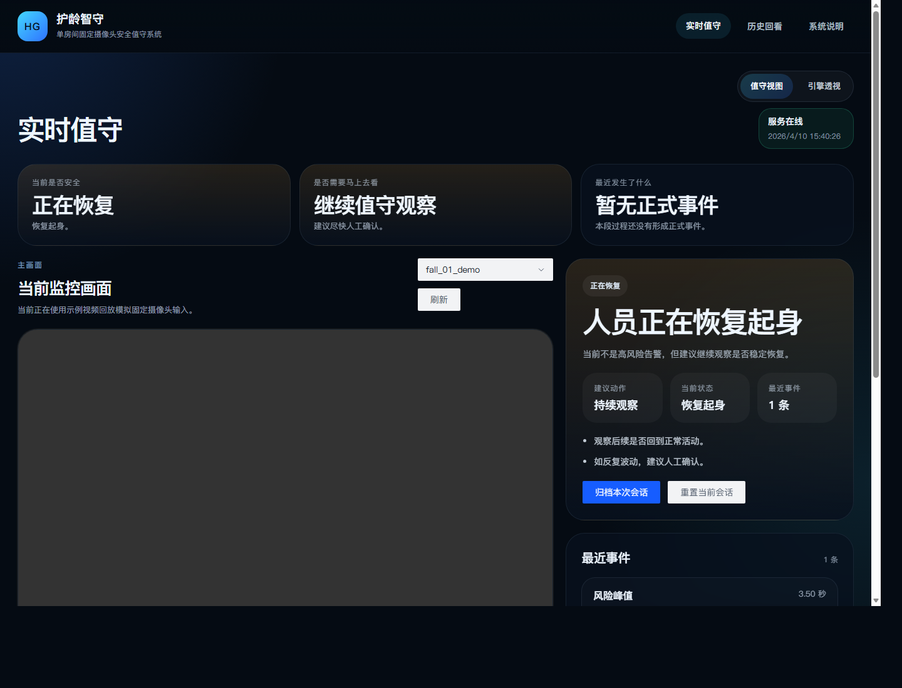

# 护龄智守

> 面向单房间固定摄像头场景的安全值守系统。
> 它不只判断“这一帧像不像跌倒”，而是持续输出一整段过程里的状态、提醒和历史记录。



## 这是什么

护龄智守是一套围绕“连续值守”设计的应用系统，核心目标只有三件事：

- 当前是否安全
- 是否需要马上去看
- 最近到底发生了什么

系统只保留一条主技术路线：

`RTMO -> Scene-Pose Temporal Net -> EventEngine -> FastAPI/Vue/SQLite/Docker`

它不把单帧识别结果直接交给用户，而是把连续状态流稳定成真正可用的结果：

- 当前状态
- 风险变化
- 正式提醒
- 过程摘要
- 历史回看

## 当前已经做成的能力

### 1. 三种真实输入

- `实时接入`：给未来接摄像头、RTSP 或其他连续视频流预留正式入口
- `模拟监看`：用固定机位样例流完整演示实时值守链路
- `上传视频复核`：上传一段新视频，异步生成时间线、提醒和过程摘要

### 2. 三个核心页面

- `实时值守`：看当前状态、最近变化、建议动作和过程时间线
- `历史回看`：看已保存过程、关键时刻、回放和提醒
- `系统信息`：看接入方式、判断主链和运行口径

### 3. 五类状态

- `normal`：正常活动
- `near_fall`：失衡风险
- `fall`：跌倒
- `recovery`：恢复起身
- `prolonged_lying`：长卧风险

## 系统怎么工作

```text
视频输入
  -> RTMO 姿态估计
  -> Scene-Pose Temporal Net 时序识别
  -> EventEngine 事件稳定化
  -> 实时值守 / 历史回看 / 系统留档
```

### 关键设计

- `连续判断`：不是只看一帧，而是用固定时间窗判断一段过程
- `质量约束`：持续监测骨架质量、关键点平均置信度、可见关节比例
- `历史留档`：当前过程只有在点击“保存到历史回看”后才会进入历史回看页
- `单一路线`：不引入第二套模型、不做双栈切换、不靠假页面兜底

## 当前模型结构

当前主线模型为 `Scene-Pose Temporal Net`，内部采用混合时序结构：

- `Pose Encoder`
- `Quality-Aware Spatial Summary`
- `Feature Fusion`
- `Residual Temporal Blocks`
- `Transformer Encoder`
- `Quality-Weighted Pooling`
- `frame / clip / risk` 三类输出头

当前运行时口径：

- `window_size = 64`
- `inference_stride = 4`

更完整的模型结构、训练口径和实验结论见：

- [docs/模型与实验说明.md](docs/模型与实验说明.md)
- [docs/项目设计说明.md](docs/项目设计说明.md)
- [docs/1.0发布检查清单.md](docs/1.0发布检查清单.md)

## 当前版本状态

截至 `2026-04-11`：

- 系统层已经具备 `1.0` 发布基础
- `实时接入 / 模拟监看 / 上传视频复核` 三条输入链路已打通
- Web 端已支持桌面和移动端浏览
- `v19` 相比前一轮明显提升了 `near_fall`，但整体晋级结论仍为 `hold`

这意味着：

- 应用系统可以继续作为 `1.0` 发布基线推进
- 模型主干仍在继续优化，尤其是 `fall / recovery` 两类

## 快速启动

### 1. 本机 Docker 运行

```bash
docker compose -f docker-compose.runtime.yml up --build
```

默认页面：

- [实时值守](http://127.0.0.1:18014/dashboard#/live)
- [历史回看](http://127.0.0.1:18014/dashboard#/records)
- [系统信息](http://127.0.0.1:18014/dashboard#/system)

### 2. 关键目录

- `runtime-release/`：运行时发布包
- `runtime-demo/`：模拟监看视频、预测结果、会话报告
- `runtime-data/`：运行时归档目录
- `frontend/`：Vue 前端
- `src/huling_guard/`：主代码

## 你在系统里会看到什么

### 实时值守

- 当前画面
- 当前结论
- 最近变化
- 风险时间线
- 保存到历史回看
- 开始新一段

### 历史回看

- 只显示已经保存的过程
- 可按状态筛选
- 可只看有提醒的记录
- 可直接定位到最高风险时刻和最近提醒

### 系统信息

- 当前支持哪些接入方式
- 当前主链如何组成
- 当前运行口径与阈值
- 系统如何控制误报

## 仓库结构

```text
configs/                    训练配置与运行时配置
docs/                       系统设计、模型说明与发布清单
frontend/                   Vue 3 前端
scripts/                    数据准备、训练、评估与发布脚本
src/huling_guard/           主代码
tests/                      逻辑测试
```

## 后续重点

当前后续工作集中在两条线上：

- `模型线`：继续提高 `fall / recovery` 的稳定性
- `系统线`：继续压交互细节、历史回看体验和整体发布面

---

如果你要快速理解这个项目，建议按这个顺序看：

1. [docs/项目设计说明.md](docs/项目设计说明.md)
2. [docs/模型与实验说明.md](docs/模型与实验说明.md)
3. [docs/1.0发布检查清单.md](docs/1.0发布检查清单.md)
