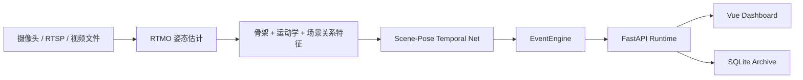

# 护龄智守

面向单房间固定机位场景的智能安全值守系统。

护龄智守把连续视频流转换成可处理的照护过程，持续输出当前状态、风险提醒、过程留档与历史回看，适用于家庭照护、护理值守和固定房间安全监看。

## 一眼看懂

- 单一路线：`RTMO -> Scene-Pose Temporal Net -> EventEngine -> FastAPI / Vue / SQLite / Docker`
- 三种输入：实时接入、模拟监看、上传复核
- 三个主页面：实时值守、历史回看、系统信息
- 五类状态：正常活动、失衡风险、跌倒、恢复起身、长卧风险
- 当前模型结论：过渡标签实验里 `v21` 最均衡，`v26` 质量监督加权实验已完成记录但仍未达到替换保留发布包的标准

## 核心能力

| 模块 | 当前能力 |
| --- | --- |
| 视频输入 | 支持实时接入、模拟监看、上传视频复核 |
| 状态识别 | 支持正常活动、失衡风险、跌倒、恢复起身、长卧风险 |
| 运行时服务 | 输出状态流、事件流、时间线、会话报告 |
| 历史留档 | 支持保存当前过程、按状态筛选、按提醒筛选、关键时刻跳转 |
| 前端界面 | 支持桌面端与移动端浏览 |
| 工程交付 | 支持 Docker 运行、发布包打包、训练与评估脚本 |

## 系统主链



## 适用边界

### 适合的场景

- 单房间、固定机位、持续值守
- 关注老人是否安全、是否需要马上去看、最近发生了什么
- 需要过程留档和后续复核，而不是只看一帧分类结果

### 当前不主打的场景

- 多路摄像头集中调度
- 大范围移动机位或频繁变焦
- 纯云端封闭视频生态、无法暴露本地流地址的消费级摄像头

## 摄像头接入说明

这套系统接的是“视频源”，不是某一个固定品牌的摄像头 SDK。

当前已经接通的输入形式有三类：

| 形式 | 示例 | 说明 |
| --- | --- | --- |
| 本机摄像头 | `0` | 适合本机 USB 摄像头或系统可见的视频设备 |
| RTSP 流 | `rtsp://user:pass@ip:554/...` | 适合支持 RTSP 的网络摄像头、NVR 或网关转发流 |
| 本地视频路径 | `/data/demo/fall.mp4` | 适合上传复核、封闭环境测试和模拟监看 |

如果你后面买的是家用监控摄像头，只要它满足下面任一条件，就可以接到网站里：

- 直接提供 `RTSP` 流
- 通过 `NVR / ONVIF 网关 / 厂商网关` 转成 `RTSP`
- 作为本机可见的视频设备挂到运行环境里

如果摄像头是纯云端封闭型设备，只能在厂商 App 里看，拿不到 `RTSP / 本地流 / 设备节点`，那就不能直接接入当前系统。

## 页面结构

| 页面 | 用途 |
| --- | --- |
| `实时值守` | 看当前状态、最近变化、建议动作、状态时间线 |
| `历史回看` | 看已保存过程、按真实存在的状态筛选、回放关键时刻 |
| `系统信息` | 看接入方式、运行主链、运行参数和运行约束 |

## 快速开始

### Docker 运行

```bash
docker compose -f docker-compose.runtime.yml up --build
```

启动后默认地址：

| 页面 | 地址 |
| --- | --- |
| 实时值守 | <http://127.0.0.1:18014/dashboard#/live> |
| 历史回看 | <http://127.0.0.1:18014/dashboard#/records> |
| 系统信息 | <http://127.0.0.1:18014/dashboard#/system> |

### 默认目录

| 目录 | 内容 |
| --- | --- |
| `runtime-release/` | 运行时发布包 |
| `runtime-demo/` | 模拟监看视频、预测结果、会话报告 |
| `runtime-data/` | 运行时归档数据 |

## 模型与实验状态

### 模型结构

`Scene-Pose Temporal Net` 不是单纯的 LSTM，也不是纯卷积时序网络。当前主线是混合时序结构：

- `Pose Encoder`：编码 17 点骨架与关键点置信度
- `Quality-Aware Spatial Summary`：降低低质量关键点对帧表示的影响
- `Feature Fusion`：融合骨架、运动学与场景关系特征
- `Residual Temporal Blocks`：捕捉短时间局部动作变化
- `Transformer Encoder`：建模更长时间范围内的动作过程
- `Quality-Weighted Pooling`：对低质量帧降权后形成窗口级判断
- `Prediction Heads`：输出帧级辅助分类、窗级分类和风险分数

### 当前结论

截至 `2026-04-11`：

| 方向 | 状态 |
| --- | --- |
| 应用系统 | 已具备 1.0 收口基础 |
| 输入链路 | 实时接入、模拟监看、上传复核均已打通 |
| 历史回看 | 已支持保存过程、状态筛选、关键时刻回放 |
| 模型实验 | `v26` 已完成记录，但 `v21` 仍是当前过渡标签实验里更均衡的一轮 |

当前不把实验轮次写成最终定版模型。现阶段的真实判断是：

- `v21` 样本级 `macro_f1 = 0.7185`，是当前过渡标签实验中更均衡的一轮
- `v22`、`v23`、`v24`、`v25` 与 `v26` 都没有超过 `v21`
- `v24` 将 `clip_focal_gamma` 提到 `1.5` 后，`recovery_f1` 回升到 `0.4000`，但 `near_fall / fall` 明显回落
- `v25` 将 `clip_focal_gamma` 回调到 `1.0` 后，`near_fall / fall` 有所回稳，但 `recovery_f1` 又降到 `0.2000`
- `v26` 把 `quality_loss_weight` 提到 `0.10` 后，`near_fall / recovery` 维持住了，但 `normal / fall` 仍略低于 `v21`
- `fall / recovery / prolonged_lying` 仍未同时通过晋级规则
- 当前保留发布包仍不能被 `v21 / v22 / v23 / v24 / v25 / v26` 直接替换

## 仓库结构

```text
configs/                    训练配置与运行时配置
docs/                       系统设计、模型说明与发布清单
frontend/                   Vue 3 前端
scripts/                    数据准备、训练、评估与发布脚本
src/huling_guard/           主代码
tests/                      逻辑测试
```

## 文档入口

- [docs/项目设计说明.md](docs/项目设计说明.md)：产品边界、架构和运行流程
- [docs/模型与实验说明.md](docs/模型与实验说明.md)：模型结构、训练口径和当前实验结论
- [docs/状态定义手册.md](docs/状态定义手册.md)：状态定义、标注边界和复核口径
- [docs/1.0发布检查清单.md](docs/1.0发布检查清单.md)：1.0 收口检查项

## 接下来优先级

- 模型线：继续解决 `fall / recovery / prolonged_lying` 的稳定性矛盾
- 系统线：继续收口历史回看、移动端和真实接入体验
- 交付线：整理部署说明、运行口径和发布包说明
