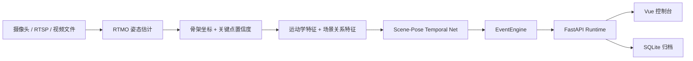

<div align="center">

# 护龄智守 Huling Guard

**面向固定机位场景的连续状态安全值守系统**

[](#当前状态) [](#快速启动) [](#产品界面) [](#模型路线) [](#快速启动)

把连续视频流转换为可查看、可提醒、可回放的照护安全过程。

</div>

## 核心能力

- **连续状态判断**：不以单帧画面作为最终结论，而是基于多帧姿态序列判断正常活动、失衡风险、跌倒、恢复起身和长卧风险。
- **姿态与质量感知**：使用 `RTMO` 输出人体关键点与置信度，并把骨架质量、速度、躯干方向等特征送入时序模型。
- **事件稳定化**：通过 `EventEngine` 将模型概率流稳定为可处置的提醒，减少单帧抖动造成的误报。
- **运行闭环**：支持监视器总览、实时值守、上传视频分析、历史回看、留档清理和运行管理。

## 模型路线

当前主线是：`RTMO` 姿态估计 + 自研 `Scene-Pose Temporal Net` 时序 `Transformer` + `EventEngine` 事件引擎。

本项目没有把主任务设计成 YOLO 检测框任务。YOLO / RT-DETR 更适合回答“画面里是否有人、人在什么位置”，而本系统需要回答“这一段连续过程中是否发生失衡、跌倒、恢复或长卧”。因此主链选择先提取人体骨架，再做时序状态识别。

- `RTMO` 提供 17 点骨架和关键点置信度，适合进入运动学特征、质量门控和时序网络。
- `Scene-Pose Temporal Net` 结合骨架序列、运动学特征、场景关系和质量特征，输出五类状态概率。
- `EventEngine` 不替代模型，只负责把连续概率流整理成稳定的业务事件。
- `YOLO-pose / RT-DETR / ST-GCN / PoseC3D` 可作为后续离线对照基线，不作为前端运行时切换方案。

## 当前状态

截至 `2026-04-11`，系统 1.0 以“可运行、可部署、可复盘”为交付目标。

- 应用链路已打通：实时接入、模拟监看、上传视频复核、历史归档与回看。
- 当前实验轮次中，`v29` 样本级整体表现最好，`sample_macro_f1 = 0.7355`，`sample_accuracy = 0.8902`。
- `v29` 的晋级结论仍为 `review`：`fall / recovery / prolonged_lying` 有提升，但 `near_fall` 相比 `v21` 回落，进入发布包替换前仍需应用级复核。
- 当前 README 不把实验轮次包装成最终上线能力；详细实验口径见 [模型与实验说明](docs/模型与实验说明.md)。

## 系统架构

<details>
<summary><b>展开查看主链 Pipeline</b></summary>



</details>

## 产品界面

| 页面 | 主要用途 | 当前能力 |
| --- | --- | --- |
| **监视器总览** | 查看全部输入源 | 展示模拟源、上传源、分析状态和风险摘要，可进入单路详情。 |
| **实时值守** | 查看当前画面与处理建议 | 支持实时接入、模拟监看、上传视频分析、算法分析层和保存留档。 |
| **历史回看** | 复核已保存过程 | 支持关键词搜索、日期筛选、状态筛选、提醒筛选、页签式回放和删除留档。 |
| **运行引擎** | 查看技术链路与运行边界 | 展示主链路、状态定义、阈值、质量控制和运行参数。 |

## 输入方式

| 输入方式 | 说明 | 适用场景 |
| --- | --- | --- |
| `实时接入` | 通过摄像头编号、RTSP 地址或容器内视频路径接入连续视频流 | 摄像头联调和部署验证 |
| `模拟监看` | 使用固定机位样例视频按实时节奏回放 | 无摄像头时的端到端展示 |
| `上传复核` | 上传新视频后异步分析并生成时间线、提醒和回看记录 | 新样本验证和案例留档 |

系统接入的是视频源，不绑定某一家摄像头厂商 SDK。若消费级摄像头无法提供 RTSP、本地流或可访问的视频设备节点，则不能直接接入。

## 快速启动

运行时依赖已构建好的 Vue 前端发布包。首次运行建议先构建前端，再启动 Docker 运行时：

```bash
cd frontend
npm install
npm run build
cd ..
docker compose -f docker-compose.runtime.yml up --build
```

默认访问地址：

- 控制台入口：<http://127.0.0.1:18014/dashboard>
- 健康检查：<http://127.0.0.1:18014/health>

## 目录结构

```text
huling_guard/
├── frontend/             # Vue 3 控制台源码
├── scripts/              # 数据准备、训练、评估与部署脚本
├── src/huling_guard/     # 模型、运行时后端与核心代码
├── runtime-release/      # 运行时发布包
├── runtime-demo/         # 模拟监看视频、预测结果与样例报告
└── runtime-data/         # SQLite 归档与运行时数据
```

## 文档入口

- [系统设计说明](docs/项目设计说明.md)
- [模型与实验说明](docs/模型与实验说明.md)
- [状态定义手册](docs/状态定义手册.md)
- [1.0 发布检查清单](docs/1.0发布检查清单.md)
- [开源对标与方向校验](docs/开源对标与方向校验.md)

## 许可说明

当前仓库尚未单独附带 License 文件。正式开源发布前，需要补齐许可声明与再分发边界。
